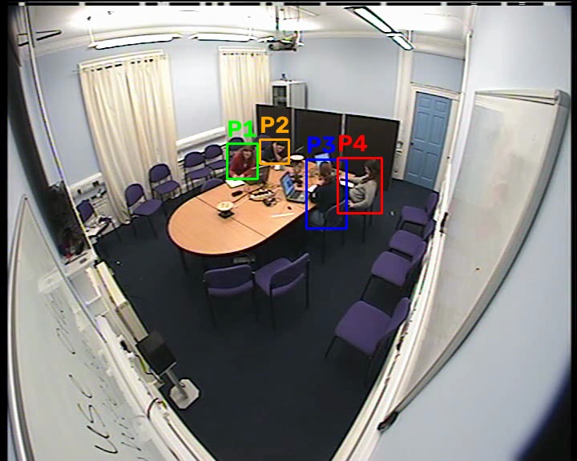

# who-follows-whom

**Behavioral coordination from frozen video embeddings — who follows
whom, when, and what visibly happened.**

A local-only, no-training pipeline that takes a fixed-camera video of
people around a table (a meeting, a board game) and estimates **who
temporally coordinates with whom, in which direction, and when** —
then has a local VLM describe the flagged moments. Runs end-to-end on
a MacBook Air (Apple Silicon, 16 GB). No footage leaves the machine.

## Framework


V-JEPA decides *which pair-episode is temporally interesting*; Gemma
reports *what is visible*. No model is trained or fine-tuned; JEPA's
numbers never enter the VLM — the interface between them is a
calibrated statistical selection.

### Tuning guide

All parameters live in `vjepa-gemma-demo/src/config.py`.

| Parameter | Default | What it controls | Change when |
|---|---|---|---|
| `window_sec` | 5.0 | Interval length; one behavioral episode should fit inside | Slower phenomena (posture convergence): 10, with `frames_per_window` 64 to keep time-resolution |
| `frames_per_window` | 32 | Temporal sampling; /2 = embedding steps per window | Raise together with `window_sec` |
| `max_lag` | 4 | Max follower delay tested, in steps (~0.31 s each; 4 ≈ 1.25 s) | Lag histogram in `z_matrix.csv` piles at the cap → raise to 6 |
| `n_null` | 500 | Null samples per window; z precision | Precision-sensitive analyses: 1000+ |
| `det_conf` | 0.15 | Person-detection threshold | People small/missed: lower; spurious tracks: raise |
| `min_track_coverage` | 0.10 | Min fraction of frames for a kept person | Fewer people found than real: lower |
| `gemma_frames` | 5 | Frames shown to the describer per interval | Grounding experiments: raise to 8-10 |
| `gemma_max_tokens` | 1200 | Generation budget; reasoning models think first | `[unfinished-reasoning]` outputs appear: raise |
| `run_control_pair` | True | Confabulation control description | Keep on for any reported result |

## What it currently shows



*Tracking output on the AMI Meeting Corpus (meeting ES2010a, Corner
camera). Video: AMI Meeting Corpus, CC BY 4.0 (Carletta, 2007).*

On an AMI Meeting Corpus segment (4 people, 2 minutes): pair-interval
coordination z-scores exceed the timing-scrambled null far above
chance rate, with a stable, differentiated pair structure — and the
built-in blinding experiment shows that VLM descriptions under a
leading prompt are prompt-driven rather than video-driven, a
measured caution for pipelines that bolt VLM narration onto
detectors. Interpretation of all quantities: temporal coupling of
visible behavior — not friendship, intention, or group membership.

## Getting started

Full path from clone to finished experiments (model downloads, test
video, Stage 1/2, blind-vs-framed comparison, how to read z / S / F):
**[GUIDE.md](GUIDE.md)**. Design rationale and the phased research
plan: **[METHOD.md](METHOD.md)**.

Quick version:

```bash
./setup.sh
./gemma-server.sh
./run.sh game.mp4 --production
```

Experiment mode (control descriptions, blind condition, full
statistics) and stage-by-stage runs: see GUIDE.md.

## Data and models (not included, not redistributable here)

- **AMI Meeting Corpus** — CC BY 4.0; downloaded by the user from the
  official mirror (see GUIDE.md §6). The tracking example figure above
  is derived from it under that license. Citation: J. Carletta,
  "Unleashing the killer corpus: experiences in creating the
  multi-everything AMI Meeting Corpus," Language Resources and
  Evaluation 41(2), 2007.
- **V-JEPA 2 weights** (`facebook/vjepa2-vitl-fpc64-256`) — Meta's
  license, via HuggingFace.
- **Gemma vision GGUF** — any model + mmproj pair under `models/`
  works; the user downloads their chosen build, which carries its own
  license.

## License

Code: MIT (see LICENSE). Datasets and model weights retain their own
licenses.
